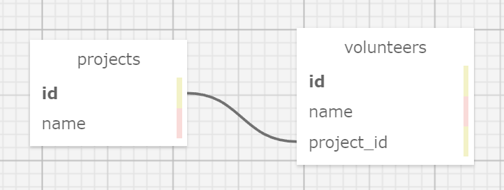

# Volunteer Tracker

#### By Drew Henderson

#### This website allows users to add a list of projects and add volunteers to the projects.

## Technologies Used

* Docker
* Ruby
* Gems
* Bundler
* Rspec
* Sinatra
* Capybara
* Postgres
* SQL
* SQL Designer

## Description

This site shows a list of projects on the home page, which can be added to or clicked on to view a specific project. Users can edit the project name, delete the project, view the volunteers signed up for it, or add more volunteers. Clicking on a volunteer lets you view them and change its name.

## Setup/Installation Requirements

* Clone the project using ```git clone https://github.com/DrewHendersonGitHub/code-review-9``` into a new directory on your computer.
* Open the project, comment out line 9 in app.rb, and save it.
* Run ```docker-compose up``` in a terminal.
* In a new terminal, run ```docker ps``` and copy the container id for postgres.
* Run ```docker exec -it -u postgres [CONTAINER_ID] psql``` with the container id replaced.
* Create a new data base using ```CREATE DATABASE volunteer_tracker;```.
* Exit postgres using ```\q``` and run ```docker exec -i [CONTAINER_ID] psql --username postgres volunteer_tracker < database_backup.sql``` with the container id replaced to restore the database.
* Uncomment out app.rb line 9 and run ```docker-compose up --build```.
* To run tests, enter ```docker-compose run --rm web bundle exec rspec``` into the terminal.
* Open a browser and go to http://localhost:4567/ to use the site.


## Known Bugs

There are currently no known bugs.

## License

[MIT](https://opensource.org/licenses/MIT)

Copyright (c) 2021 Drew Henderson

